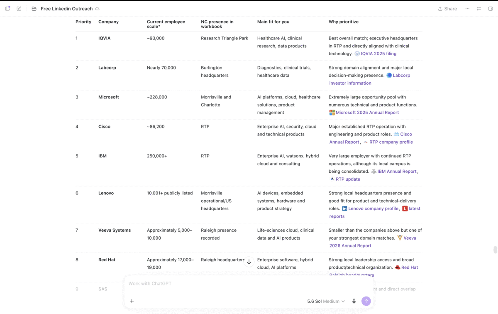

<p align="center">
  <a href="https://github.com/apurva-dange/free-linkedin-outreach/blob/main/LICENSE">
    
  </a>
  <a href="https://www.python.org/downloads/">
    
  </a>
  <a href="https://github.com/apurva-dange/free-linkedin-outreach">
    
  </a>
  <a href="https://github.com/apurva-dange/free-linkedin-outreach">
    
  </a>
  <a href="https://github.com/apurva-dange/free-linkedin-outreach/pulls">
    
  </a>
  <a href="https://github.com/apurva-dange/free-linkedin-outreach/stargazers">
    
  </a>
</p>


# Free LinkedIn Outreach

Free LinkedIn Outreach helps job seekers find the right people, write short personal messages, and prepare LinkedIn outreach with fewer clicks.

## Project Demo

The demo shows the full flow: choose priority companies, review verified contacts, select a company, copy the message, open LinkedIn, and track prepared contacts.

<p align="center">
  
</p>

## The problem

LinkedIn outreach can become repetitive very quickly.

For every person, you may need to:

1. Find the correct profile.
2. Check whether the person still works at the company.
3. Write a message that fits their role.
4. Copy the message.
5. Open the LinkedIn profile.
6. Track whether you already contacted them.

Search results can also show former employees. This can lead to an awkward message that talks about a company where the person no longer works.

## The solution

This skill creates a verified outreach batch and a simple message queue.

For each contact, it can:

- Check the person's company and current role.
- Explain whether the person is a current employee, former employee, founder, adviser, or parent-company contact.
- Write a personal LinkedIn message under 300 characters.
- Add a **Copy + Open LinkedIn** button.
- Copy the message and open the correct LinkedIn profile with one click.
- Turn the contact card green after it is prepared.
- Show a checkmark and update the progress count.

### Expected impact

- Saves about **3–4 manual clicks or actions per contact** by combining copy, profile opening, and status tracking.
- Saves roughly **150–200 actions in a 50-contact batch**.
- Reduces repeated outreach and messages sent to people who no longer work at the target company.
- Keeps the final connection request manual, so the job seeker can review every message before sending it.

You still click **Connect**, add the note, review it, and send it yourself.

## Who the skill finds

The normal target is five useful people from each company:

1. A recruiter or talent acquisition partner.
2. A second recruiter, HR partner, or people leader.
3. A likely hiring manager.
4. A relevant product, engineering, software QA, AI, data, program, or operations team member.
5. Another useful manager, senior team member, founder, or referral contact.

Small companies may not have two recruiters. In that case, the skill can use an HR leader, people leader, or founder. It must label the person honestly instead of pretending that they are a recruiter.

## How contacts are checked

Before adding someone, the skill checks:

- The person's identity.
- Their current company.
- Their current title.
- Their relevance to the job or target department.
- Their direct LinkedIn profile URL.

Each contact is marked as one of the following:

- Current employee
- Former employee
- Parent-company contact
- Founder or adviser
- Industry or referral contact
- Uncertain

Current employees are preferred.

If a person no longer works at the target company, the message must not describe them as a current employee. The company name should be removed when needed, and the note should become a general job or referral question.

The skill also checks earlier batches so the same person is not added again.

## How messages are written

Every connection note must be shorter than 300 characters because of Linkedin New Connection Req character limits, including spaces.

The message should contain four simple parts:

1. A greeting and short introduction.
2. The job seeker's most relevant strengths.
3. Interest in the company, team, or type of role.
4. A clear request to review the profile, suggest a suitable role, or connect the job seeker with the right person.

The action changes based on the recipient:

- **Recruiter:** Ask them to review the profile and suggest matching roles.
- **Hiring manager:** Ask whether the background may fit their team.
- **Team member:** Ask which role or department may be relevant.
- **Executive or founder:** Ask for direction to the correct person.
- **Former or uncertain employee:** Ask a general career or referral question without claiming they currently work at the company.

The messages should be direct and human. They should not use fake praise or lines such as “your work is fascinating.”

## The outreach queue

The queue groups contacts by company and shows:

- Name
- Current title
- Function
- Employment status
- Customized message
- Message character count
- Outreach progress

Each contact has one **Copy + Open LinkedIn** button.

When the button is pressed:

1. The customized message is copied.
2. The LinkedIn profile opens in a new tab.
3. The contact card turns green.
4. The status changes to **Prepared**.
5. The progress count increases.

Prepared contacts can stay marked through local browser storage.

## What this skill does not do

The skill does not automatically:

- Click Connect
- Click Add a note
- Send a connection request
- Send a LinkedIn message
- Follow a person
- Bypass LinkedIn login or platform limits

This keeps the final action manual and reduces account risk.

## Installation

### Option 1: Ask Codex to install it

Give Codex this repository URL:

```text
https://github.com/apurva-dange/free-linkedin-outreach
```

Then ask:

```text
Install the Free LinkedIn Outreach skill from this GitHub repository.
```

### Option 2: Install it manually

1. Clone or download this repository.
2. Copy the full repository folder into your Codex skills folder.
3. The usual local location is:

```text
~/.codex/skills/free-linkedin-outreach
```

4. Keep the folder structure unchanged.
5. Refresh the Skills page or open a new conversation if the skill does not appear immediately.

## How to use it

Call the skill by name:

```text
Use $free-linkedin-outreach for these 10 companies. Find five current contacts per company, including two recruiters where possible. Use my resume to write messages under 300 characters and create the Copy + Open LinkedIn queue.
```

Use it with a job post:

```text
Use $free-linkedin-outreach with this job URL. Find the recruiter, likely hiring manager, and three relevant team members. Do not reuse people from my earlier batches.
```

Check an older outreach list:

```text
Use $free-linkedin-outreach to review this contact batch. Check who still works at each company. Rewrite messages for former employees as general job inquiries.
```

Create another batch:

```text
Use $free-linkedin-outreach to prepare the next 20 contacts. Keep the messages under 300 characters and create the one-click outreach queue.
```

## Files in this repository

- `SKILL.md` contains the full workflow and rules.
- `agents/openai.yaml` contains the skill information shown in the interface.
- `references/contact-schema.md` explains the contact data fields.
- `scripts/validate_outreach.py` checks contact counts, duplicate profiles, LinkedIn URLs, employment labels, and message lengths.
- `assets/icon.svg` contains the skill icon.

## Validate a contact batch

The validator supports JSON and CSV files.

```bash
python3 scripts/validate_outreach.py contacts.json \
  --contacts-per-company 5 \
  --max-message-length 299
```

It reports problems such as:

- Missing contact information
- Messages that are too long
- Duplicate LinkedIn profiles
- Invalid profile URLs
- Unsupported employment labels
- Incorrect contact counts

It also warns when a company does not have two recruiting or people contacts.
